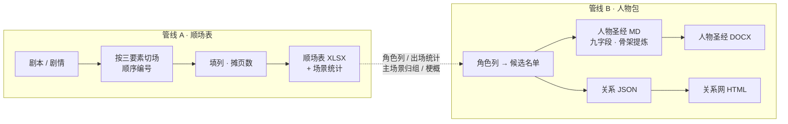

# Coco 影视前期统筹

**把剧本拆成能拍的表，把人物理成能用的体系。**

<div align="left">


</div>

---

## 为什么需要它

影视前期有两件苦活：**把剧本切成能排期的场次**，和**把人物理成全组共用的体系**。
前者决定周期与预算，后者决定选角与后续几季。这两件事通常靠人工数、靠 Word 攒、靠口述传，
版本一多就散。

本 skill 把它们做成两条可复跑的管线：输入是剧本（或剧情），输出是三份能直接进生产流程的文件。

| | 人工做法 | 本 skill |
|---|---|---|
| 分场 | 人数场次、编号容易跳号重号 | 场号顺序纯数字、不跳不重，脚本强制 |
| 页数 | 拍脑袋，各集口径不一致 | 按权重摊派，各集总页数对得上原剧本 |
| 统计 | 另做一张表，改一次重算一次 | 自动生成，与主表同源 |
| 人物小传 | 散在多个 Word，格式各写各的 | 九字段固定结构，一次成册 |
| 人物关系 | 靠嘴说，新人看不懂 | 力导向关系网，可拖拽/隔离/筛选 |

---

## 两条管线



**常规链路是 A → B。** 顺场表跑完，它的角色列直接就是人物包的候选名单——
不用重新读一遍剧本。两条也可以单独跑：只要场次就跑 A，只要人物就跑 B。

---

## 管线 A · 顺场表

### 分场判据

**一场 = 同一时间 + 同一空间 + 同一组人 的连续戏。**
剧本的场景标题行天然就是分场标记，脚本标题行一变就是新的一场。

一场之内变了下面任一项，**直接开新场号**（不用 1A/1B 后缀）：

| 变了什么 | 举例 |
|---|---|
| 具体位置 | 客厅说话 → 走进卧室继续 |
| 氛围转折 | 前半温馨 → 后半翻脸 |
| 时间档 | 黄昏坐到天黑 |
| 内外 | 从屋内追到门外 |
| 叙事主体切走 | A 在客厅 → 切到 B 在车上 |
| 中间插了别的戏 | 这场拍一半插别场，回来接着拍 |

只是镜头切了（正反打）、人物进出、对白段落多——**不另起场**，那是分镜的事。

### 列结构（固定 15 基础列 + 角色列组）

```
集 · 场号 · 日/夜 · 内/外 · 主场景 · 场景 · 氛围 · 内容梗概 · 页数
  · 角色列组（每人一列）· 特约 · 群众 · 道具 · 视效 · 备注
```

- **主场景**由脚本从场景列自动解析（`陈默家-客厅` → `陈默家`），统筹归组用
- **角色列组固定排在页数之后**，表头写全名、格内填单字缩写
- 特约 / 群众走独立列，不占角色列——角色列只放主要演员，不然表会太宽
- 备注列永远留空给用户手填

### 页数不是拍脑袋

先量每集剧本页数，再按权重摊到各场：

```
页数 = 集总页数 × w / Σw     w ∈ {1 过场, 2 标准, 3 较长, 4 重场戏}
```

四舍五入到 0.1 页、最小 0.1、末行吃尾差。**这样每集总页数一定对得上原剧本。**
PDF 直接读页数；DOCX / 纯文本用已知页数的集反推密度（中文剧本约 700–800 字/页）再折算。

### 场景统计 sheet（自动生成）

| 区块 | 回答什么 |
|---|---|
| 一、总览 | 总场数、总页数、预估总时长（1 页 ≈ 1 分钟）、平均单场页数 |
| 二、日·夜分布 | **夜戏占比** —— 决定周期与预算 |
| 三、内·外分布 | **外景占比** —— 天气风险 |
| 四、按主场景归组 | 页数降序带占比，页数最多的就是主景，统筹照这个排拍摄日 |
| 五、角色出场 | 场数降序带页数，**演员档期直接看这个** |

---

## 管线 B · 人物包

### 人物圣经：九字段 + 两组骨架

每人一块，固定九个字段：

```
身份定位 → 外貌与标志性符号 → 性格内核 → 前史 → 本季弧线（逐集）
→ 核心戏剧功能（Vogler 原型）→ 关系清单 → 台词风格 → 给演员/导演的提示
```

**最关键的一步是提炼骨架，不是堆人。** 至少要找出两组对照结构：

1. **反派阶梯** —— 主角一路打穿的东西必须逐级变大
   （私仇/一个人 → 共谋/身边人 → 规则/一个机构 → 制度/整张网）
2. **同一处境的不同答案** —— 相似起点的人做了不同选择，各有各的下场

找不到就说明没读懂。**宁可回去重看剧本，不要硬编。**

### 关系网：自己写的物理引擎

零依赖单文件 HTML，双击即开。节点不是摆上去的，是**算出来的**——
关系紧的自然靠拢，仇敌自然被推开，谁跟谁近一眼能看出来。

| 机制 | 做法 |
|---|---|
| 斥力 | 各向异性椭圆——节点带两行标签，竖直方向更占地方，斥力场按包围盒拉伸 |
| 弹簧 | 按关系类型分档：情感最紧（L=104），控制最松（L=172） |
| 防重叠 | 独立于 alpha 的硬位置修正，标签零重叠 |
| 多重关系 | 同一对人物的多条边对称弯开，不叠成一根线 |
| 启动序列 | 预热定 alpha 推开 → 收敛衰减 → 自适应视野 → 只留极小余温 |

| 交互 | 效果 |
|---|---|
| 拖拽节点 | 甩出去，全网重新找平衡；松手钉住，双击解钉 |
| 悬停 | 只留他和他的关系，其余淡出，连线浮出关系名 |
| 双击 | 隔离模式——只留一阶邻域并自动放大居中 |
| 类型开关 | 关掉一类关系，剩下的网当场重排 |
| 阵营标签 | 点一下隐藏该阵营，网络跟着收拢 |
| 搜索 | 输入定位并镜头飞过去 |

---

## 快速开始

```bash
SK=~/.workbuddy/skills/coco-preproduction

# 管线 A：顺场表
python  $SK/scripts/scene/make_scene_breakdown.py data.json -o 顺场表.xlsx --html

# 管线 B：人物包
python3 $SK/scripts/character/force_graph.py characters.json -o "《剧名》人物关系网.html"
python3 $SK/scripts/character/md2docx.py "《剧名》人物圣经.md" -o "《剧名》人物圣经.docx"
```

只依赖 Python 3.9+（openpyxl 缺失时脚本自动装）。关系网产出的 HTML 零依赖。

### 顺场表最小输入

```json
{
  "title": "《雨夜来客》顺场表",
  "meta": { "角色缩写": "陈=陈默(男主) / 林=林晚(女主) / 周=老周" },
  "roles": ["陈", "林", "周"],
  "columns": ["ep","scene","daynight","inout","mainset","set","mood","synopsis","pages","cast","extra","mass","props","vfx","note"],
  "rows": [
    {"ep":"3","scene":"1","daynight":"夜","inout":"内","set":"陈默家-客厅",
     "mood":"温馨","synopsis":"陈默冒雨回家，林晚已等了三个小时，桌上饭菜凉透。",
     "roles":["陈","林"],"pages":0.5,"props":"凉掉的饭菜、湿雨衣"}
  ]
}
```

### 关系网最小输入

```json
{
  "factions": [{"id":"hou","name":"江氏旧宅"}],
  "nodes": [{"id":"si","name":"阿萤","sub":"方四 · 沈萤","ring":0,"fac":"hou","desc":"小传…"}],
  "edges": [{"a":"si","b":"hqc","t":"blood","label":"父女","note":"给字「籽安」"}]
}
```

生成器带自检：id 重复、关系指向不存在的人、自环、阵营或类型未定义、孤立节点，
有问题直接报错退出，**不会给你一个白屏的网页**。

---

## 目录

```
coco-preproduction/
├── SKILL.md                          主文档：路由 + 两条管线 + 自检清单
├── manifest.yaml                     市场元数据（触发词 / 描述 / 分类）
├── scripts/
│   ├── scene/make_scene_breakdown.py 顺场表生成器（补主场景列 + 统计 sheet）
│   └── character/
│       ├── force_graph.py            关系网生成器（含自检）
│       ├── template.html             力导向引擎模板
│       └── md2docx.py                Markdown → Word
├── references/
│   ├── scene-rules.md                分场判据 · 氛围词库 · 时间档
│   ├── scene-breakdown-schema.md     列定义 · 角色列规范 · 统计口径
│   ├── character-bible-structure.md  人物圣经六章结构 · Vogler 原型对照表
│   └── web-design.md                 关系网物理参数与调参说明
└── examples/
    ├── scene/                        顺场表样例（20 场完整 / 3 场最小）+ 成品
    └── character/                    关系网样例（8 人最小 / 21 人完整规模）
```

---

## 边界

| 你要什么 | 该用谁 |
|---|---|
| 场次 / 页数 / 主场景归组 / 演员档期 | 本 skill 管线 A |
| 人物小传 / 关系网 / 人物功能 | 本 skill 管线 B |
| 镜头 / 景别 / 运镜 / 怎么拍 | 分镜表 skill（本 skill 不管镜头级拆分） |
| 拍摄顺序排期 / 通告单 | 通告单工具（顺场表场次顺序 = 剧本顺序，不做重排） |

---

## 版本

| 版本 | 变更 |
|---|---|
| **2.0.0** | 由 `coco-scene-breakdown` v1.3.0 与 `coco-character-bible` v1.0.0 合并成一个包。两条管线并装、脚本分目录、主文档加路由表按需加载，能力无删减 |
| 1.3.0 | 角色列表头改全名、格内填单字缩写；移除「时长」「累计页数」两列；页数移到内容梗概之后 |
| 1.0.0 | 人物包首发：人物圣经 Word + 力导向关系网 HTML |

---

## 许可

MIT — 见 [LICENSE](./LICENSE)。

> 本 skill 的示例全部基于虚构剧本《霜刃行》，仅结构（人数 / 关系数 / 阵营数 / 层级）
> 参照真实长篇项目的典型规模，内容无一涉及真实项目。
